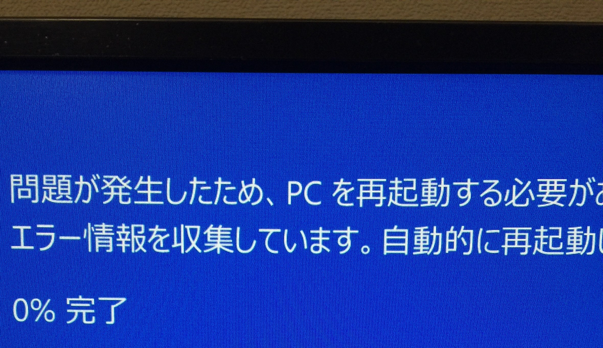

<a class="twitter-timeline" data-width="400" data-height="600" data-theme="light" href="https://twitter.com/masaoyamad?ref_src=twsrc%5Etfw">Tweets by masaoyamad</a> 

# About

2019年にプログラミングを始めた無職です！  
以前は2年間異業種に勤めていました。  
出来ることを増やしたい！

## Profile
- 山田まさお
- 各地を転々としている
- Webサービス、競プロ勉強中

# Skills
- OS(Windows, Ubuntu, mac)
- Languages(HTML, CSS, JavaScript, C++, Python)
- Engine, Frameworks(Node.js, Express)
- Tool, MiddleWare(Git, PostgreSQL)

# Works
- [Github](https://github.com/masaoyamada)
- 作った作品
  - [匿名掲示板](https://quiet-everglades-46274.herokuapp.com/posts)(ゲストID:guest1, Pass:0roJeJOs)
  - [スケジュール管理アプリ](https://mighty-shore-05332.herokuapp.com/)(要GitHubアカウント)

# Contact
- [Twitter](https://twitter.com/masaoyamad)
- [Mail](mailto:nagashima775@gmail.com)

# History
- 2019年 無職
- 2017年 就職
